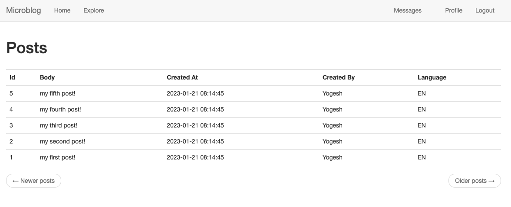

# Wellfound's microblog assessment!

## Changes for the assignment
* Created an endpoint to insert "real" posts so that we can get posts from the database instead of hardcoded values.
* Made changes in the index method to return posts from the database
* Made changes in the index template to show the posts stored in the database.

## Screenshot of homepage
